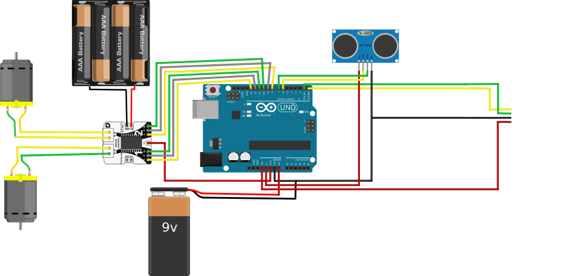

# Bleutooth-controlled-car

This project is developed for the users to control a Car through
Bluetooth. The user can control different movements like
forward, backward, left and right plus to enable/disable the
auto-control mode. The Bluetooth receiver is connected with a
phone. An application is used to operate the transmission.
 
First the transmitter and the receiver are synchronized. When
the user presses a specific button on the application interface,
the Bluetooth receiver implemented on the motor shield
receives the signal and accordingly send the information to the
Arduino UNO microcontroller which sends back the order to the
motor shield.
 
The motor shield controls the operation of the Car through
external electronic circuit. The circuit is used as a switch to
operate the particular motor in the Car. By this way the user
can control any of the operations of the Car.
In the auto-control mode the Car uses an Ultra-Sensor to detect
obstacles and moves left or right to avoid them.
## Hardware Specifications:
### List of Hardware :
- Arduino UNO card 
- Motor shield
- Bluetooth module
- Car chassis
- Ultrasensor
- Wires
- Resistor
### General circuit:

### Hardware interfaces :
#### Arduino UNO :
- Pins : 8 → 13 to communicate with the motor shield.
- Pins : 6 and 7 for the Ultrasensor.
- Serial(Tx/Rx) : for communication with the Bluetooth.

## Car movements specifications :
### Manuel Controlling :
The car in this mode is controlled using orders given from user through the android application. 
The list of orders :  
Start, forward, backward, left, right, stop.

### Auto-Driving mode :
In this mode the car uses the ultrasensor to detect obstacles and avoid them  
**System Variables :**
Distance = duration * 0.034 / 2  
Safe distance : 10cm  
